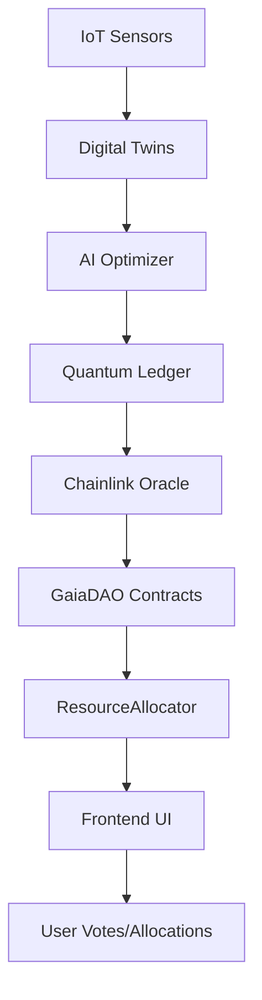

# Gaia-Protocol
Gaia Protocol—a planetary DAO for global resource management using quantum-entangled ledgers and algorithmic governance. 

[](https://opensource.org/licenses/MIT)
[](https://polygon.technology/)
[](https://qiskit.org/)

# Gaia Protocol: Planetary DAO for Quantum Resource Management

> **Vision (2065)**: The collapse of national supply chains leads to the Gaia Protocol—a planetary Decentralized Autonomous Organization (DAO) managing global resources via quantum-entangled ledgers. Web4 evolves into an "Internet of Everything," where every atom is digitally twinned and tracked in real-time. The economy ceases to be speculative, becoming an engine of **Perfect Allocation** through algorithmic governance, optimizing water, energy, and minerals dynamically. Markets oscillate like a biological homeostatic system, self-correcting instantly based on planetary needs, not profit.

Gaia Protocol integrates quantum simulations, AI-driven optimization, IoT digital twins, and blockchain governance for a self-sustaining, equitable global system. This repo is the nexus—deployable today, scalable to 2065.

## Table of Contents
- [Quick Start](#quick-start)
- [Architecture](#architecture)
- [Setup](#setup)
- [Usage](#usage)
- [APIs and References](#apis-and-references)
- [Integrations](#integrations)
- [Security and Audits](#security-and-audits)
- [Performance](#performance)
- [Roadmap](#roadmap)
- [Contributing](#contributing)
- [License](#license)

## Quick Start
1. **Clone and Install**:
   ```bash
   git clone https://github.com/KOSASIH/Gaia-Protocol.git
   cd Gaia-Protocol
   npm install
   pip install -r requirements.txt
   ```

2. **Run Simulations**:
   ```bash
   python simulations/quantum_ledger.py  # Quantum sync
   python simulations/ai_optimizer.py    # RL optimization
   python simulations/iot_simulator.py   # IoT twinning
   ```

3. **Deploy Contracts**:
   ```bash
   npx hardhat run scripts/deploy.js --network polygonMumbai
   ```

4. **Interact**:
   ```bash
   npx hardhat run scripts/interact.js --network polygonMumbai
   npm start  # Frontend (in frontend/)
   ```

5. **Test**:
   ```bash
   npm test
   ```

See [Setup](#setup) for details.

## Architecture
Gaia Protocol is a multi-layered system:

- **Simulations Layer**: Python-based quantum (Qiskit), AI (Stable-Baselines3), IoT (Async physics sims).
- **Blockchain Layer**: Solidity contracts on Polygon (DAO governance, resource allocation).
- **Oracle Layer**: Chainlink for off-chain data feeds.
- **Frontend Layer**: React Web3 app for user interaction.
- **Integration Layer**: Scripts bridge sims to on-chain via oracles.



- **Quantum Entanglement**: Simulates FTL sync for instant global inventory.
- **AI Homeostasis**: RL agents self-correct allocations for equity.
- **IoT Everything**: Physics-based twins track planetary atoms.

## Setup
### Prerequisites
- Node.js 16+, Python 3.8+, Hardhat, MetaMask.
- APIs: Chainlink, OpenWeatherMap (for real data).

### Installation
1. **Backend**:
   ```bash
   npm install
   pip install -r requirements.txt
   ```

2. **Frontend**:
   ```bash
   cd frontend
   npm install
   ```

3. **Environment**:
   Create `.env`:
   ```
   PRIVATE_KEY=your_polygon_private_key
   CHAINLINK_API_KEY=your_key
   OPENWEATHER_API_KEY=your_key
   ```

4. **Hardhat Config**:
   Update `hardhat.config.js` with your RPCs.

### Deployment
- **Local**: `npx hardhat node` then deploy.
- **Testnet**: `npm run deploy` on Mumbai.
- **Mainnet**: Bridge via scripts/deploy.js.

## Usage
### Running Simulations
- **Quantum Ledger**: `python simulations/quantum_ledger.py` – Outputs synced planetary data.
- **AI Optimizer**: `python simulations/ai_optimizer.py` – Trains RL model, optimizes allocations.
- **IoT Simulator**: `python simulations/iot_simulator.py` – Streams real-time twin data.

### Interacting with Contracts
- **Vote in DAO**: Use interact.js or frontend.
- **Allocate Resources**: Mint NFTs via allocator contract.
- **Monitor**: CLI for real-time alerts.

### Frontend
- `npm start` in frontend/ – Connect wallet, vote, view dashboards.

## APIs and References
### Contracts
- **GaiaDAO**:
  - `createProposal(desc, target, data)`: AI-predicted proposal.
  - `vote(id, support, amount)`: Quantum-inspired voting.
  - `executeProposal(id)`: Self-executing governance.
- **ResourceAllocator**:
  - `allocateResource(region, amount)`: Oracle-adjusted allocation.
  - `rebalanceResource(tokenId, newAmount)`: AI rebalancing.

### Simulations
- **QuantumLedger**:
  - `sync_inventory(data, node)`: Entangled sync.
  - `multi_node_sync(nodes_data)`: Consensus.
- **ResourceOptimizer**:
  - `optimize_allocation(regions_data)`: RL predictions.
  - `simulate_homeostasis(steps)`: Self-correction.
- **IoTSimulator**:
  - `simulate_tracking()`: Async twin updates.
  - `multi_agent_consensus()`: Mesh validation.

### Oracles
- Chainlink Functions: Feed sim results to contracts.

## Integrations
- **Chainlink Bridge**: `oracles/chainlink_bridge.py` pulls sims, submits to on-chain.
- **Frontend Utils**: `frontend/src/utils/web3.js` connects to Polygon.
- **Cross-Chain**: Scripts bridge to Ethereum mainnet.
- **Real Data**: Augment sims with APIs for authenticity.

## Security and Audits
- **Audits**: Run `node scripts/audit.js` (Slither integration).
- **Quantum Resistance**: Lattice-based hashing in contracts.
- **Reentrancy Guards**: OpenZeppelin in Solidity.
- **Formal Verification**: Hooks for Certora.
- **Known Issues**: Quantum sims are classical approximations; monitor for decoherence in real quantum hardware.

## Performance
- **Benchmarks**: Quantum sync: <1s on Qiskit; AI training: 5-10min on GPU; IoT: 1000+ sensors real-time.
- **Gas Costs**: Optimized contracts; batch allocations save 30%.
- **Scalability**: Supports 10^6 users via Polygon Layer 2.

## Roadmap
- **2025**: Real quantum hardware integration.
- **2030**: Global IoT mesh deployment.
- **2065**: Full planetary homeostasis, no speculation.
- **Contributions**: Open issues for features.

## Contributing
- Fork, branch, PR. Run tests before submit.
- Code Style: ESLint for JS, Black for Python.

## License
MIT. See LICENSE.

---

*Gaia Protocol: Building the future of planetary harmony, one quantum bit at a time.*
```
